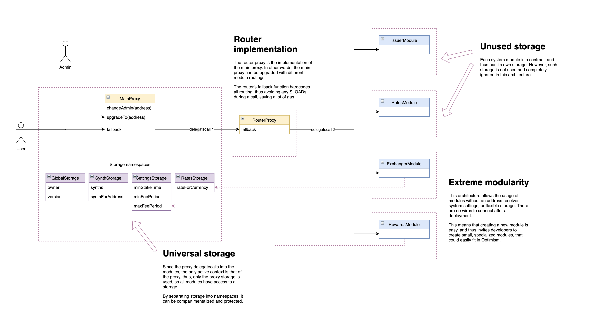

## "Router Proxy" POC #4

This proof of concept combines Open Zeppelin transparent proxies with diamond proxies.

The main Synthetix contract is a transparent proxy whose implementation is dynamically generated by tooling.

The generated Synthetix implementation contains a hardcoded lookup table from `selector` to `implementation`, allowing the proxy to perform delegatecall to multiple implementations or modules.

E.g.
```
fallback() external {
    // Function selector to implementation contract lookup table
    address implementation;
    if (
      msg.sig == 0x430fe9c1 ||
      msg.sig == 0x0d8e6e2c ||
      msg.sig == 0x03c0a389 ||
      msg.sig == 0x788bc78c
    ) implementation = 0xD2c7D79ED97DfBE878a164F261549ddEeA4aD8a6;
    else if (
      msg.sig == 0xd72e0705 ||
      msg.sig == 0x10916f3b ||
      msg.sig == 0xe6dbd15d
    ) implementation = 0x3Bb4145F86b1F6519aCBf4438A808E9Bf6C5cC8A;
    else if (
      msg.sig == 0xe017bb0d
    ) implementation = 0x8B399a32deCa6CC56A21CF6c092D9DF05211CF72;
    require(implementation != address(0), "Selector not registered in any module");

    // Delegatecall forwarder
    assembly {
        calldatacopy(0, 0, calldatasize())
        let result := delegatecall(gas(), implementation, 0, calldatasize(), 0, 0)
        returndatacopy(0, 0, returndatasize())
        switch result
            case 0 {
                revert(0, returndatasize())
            }
            default {
                return(0, returndatasize())
            }
    }
}
```



### Communication between modules

Any module can easily access any other module by casting itself to the other module, e.g:

```
contract IssuerModule {
    function getValueViaExchanger() public view returns (string memory) {
        return ExchangerModule(address(this)).getValue();
    }
}
```

This is possible because all modules have access to the main proxy's storage, which removes the need of an AddressResolver or SystemSettings contract. Given that every module also has access to every other module, this pattern allows for extreme modularity and small smart contract deployment sizes, which are needed properties of the Synthetix v3 system in Optimism.

### Storage namespaces

To avoid storage collisions, modules must not declare in-contract variables, but instead access a storage namespace. This deviates signifficanlty from regular Solidity code style, but should not introduce too much complexity for developers.

```
bytes32 constant GLOBAL_STORAGE_POSITION = keccak256("io.synthetix.global");

struct GlobalStorage {
    address owner;
    string version;
}

function globalStorage() internal pure returns (GlobalStorage storage store) {
    bytes32 position = GLOBAL_STORAGE_POSITION;

    assembly {
        store.slot := position
    }
}
```

Any number of additional namespaces can be declared, i.e.

```
...
bytes32 constant ISSUANCE_STORAGE_POSITION = keccak256("io.synthetix.issuance");
...
bytes32 constant COLLATERAL_STORAGE_POSITION = keccak256("io.synthetix.collateral");
...
```

The only caveat is that storage within a namespace is append only. Properties within a namespace cannot be renamed or reordered, and new properties can only be appended to a struct.

### Mixins

Additionally, mixins, which are not modules, can be inherited by any module for accessing common functionality.

```
contract OwnerMixin is GlobalStorageAccessor {
    modifier onlyOwner {
        require(msg.sender == globalStorage().owner, "Only owner allowed");
        _;
    }
}
```

Thus, the general architecture can be categorized as follows:

* Storage namespaces: Provide a storage structure for a particular functionality. E.g. GlobalStorage, or IssuerStorage.
* Modules: Implement a specific compartimentalized feature of the system, accessing one or more storage namespaces, and requiring an implementation contract to be deployed and hardcoded into the main proxy.
* Mixins: Intended to be inherited by modules, can access any storage namespace, add functions and modifiers to a module, and are not intended to be deployed as an implementation contract. E.g. OwnerMixin.
* Libraries: Provide common functionality to modules, without inheriting. E.g. SafeDecimalMath.

### Development considerations

Developers will need to:
* Only use storage via namespaces
* Always append variables to a namespace storage struct (enforced by tooling)
* All functions in modules need to be unique (enforced by tooling)

The lookup table in the main proxy's implementation is generated in order to reduce a bit of gas, but mainly for removing any kind of diamond proxy complexity from the Solidity code.

### Testing this experiment locally

1. Start local node with `npx hardhat node`
2. Deploy the system with `npx hardhat run scripts/deploy.js`
3. Run tests with `npx hardhat test`

Additionally, step 2 can be broken up into these commands:
* Clear local deployment data with `npx hardhat run scripts/clear-deployments.js`
* Deploy system moduels with `npx hardhat run scripts/deploy-modules.js`
* Generate main proxy router with `npx hardhat run scripts/generate-proxy.js`
* Deploy main proxy router `npx hardhat run scripts/deploy-proxy.js`

### Open questions

#### How would this look in a real system?

A non-compilable, non-deployable pseudo code can be found in the `pseudocode` folder. It shows what Issuer could look like if implemented with this architecture.

#### How big can the router contract be?

Regarding deployment sizes, running `generate-test-proxy` produces a router contract with 20 modules with 40 functions each (800 selectors). With 200 runs optimization, this router contract compiles and deploys just fine. This shows that the number of routings available should not be limiting at first glance.

If this limit ever needed to be exteneded, the router contract could be constructed at a bytecode level, or even switched at any time to a storage based approach (which wouldnt be good for runtime gas costs).

#### Do runtime gas costs increase as the router grows in size?

TBD

Although untested, this is expected to be true, which would be unfortunate.

If so, there might be better ways to identify which implementation a selector belongs to by some sort of function that combines the selector with some sort of constant, and directly produces the target implementation.

#### How big can the struct of a storage namespace be?

TBD

There could be limitations to how big a storage namespace can become. If so, using multiple namespaces or even sub-namespaces would be a solution. Nonetheless, this should be researched.
